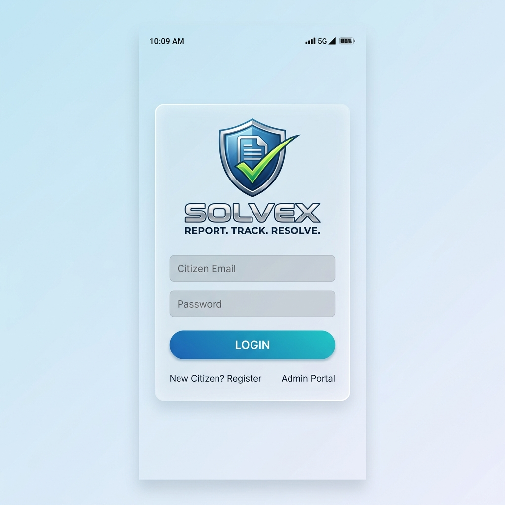
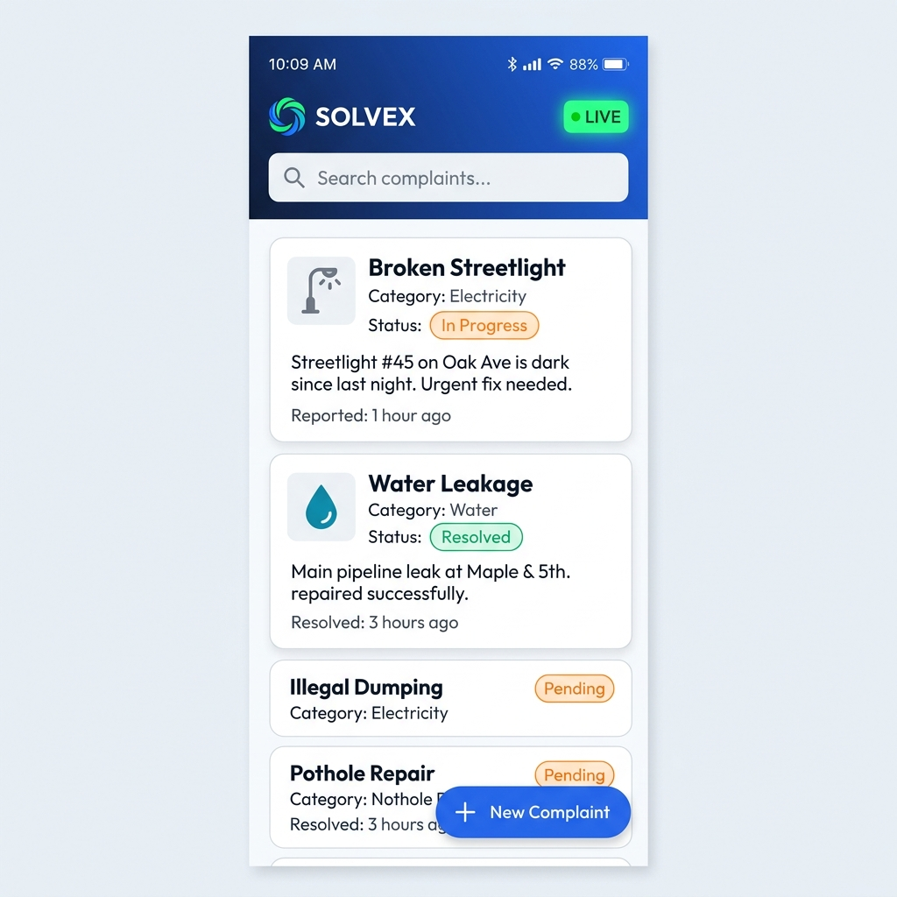
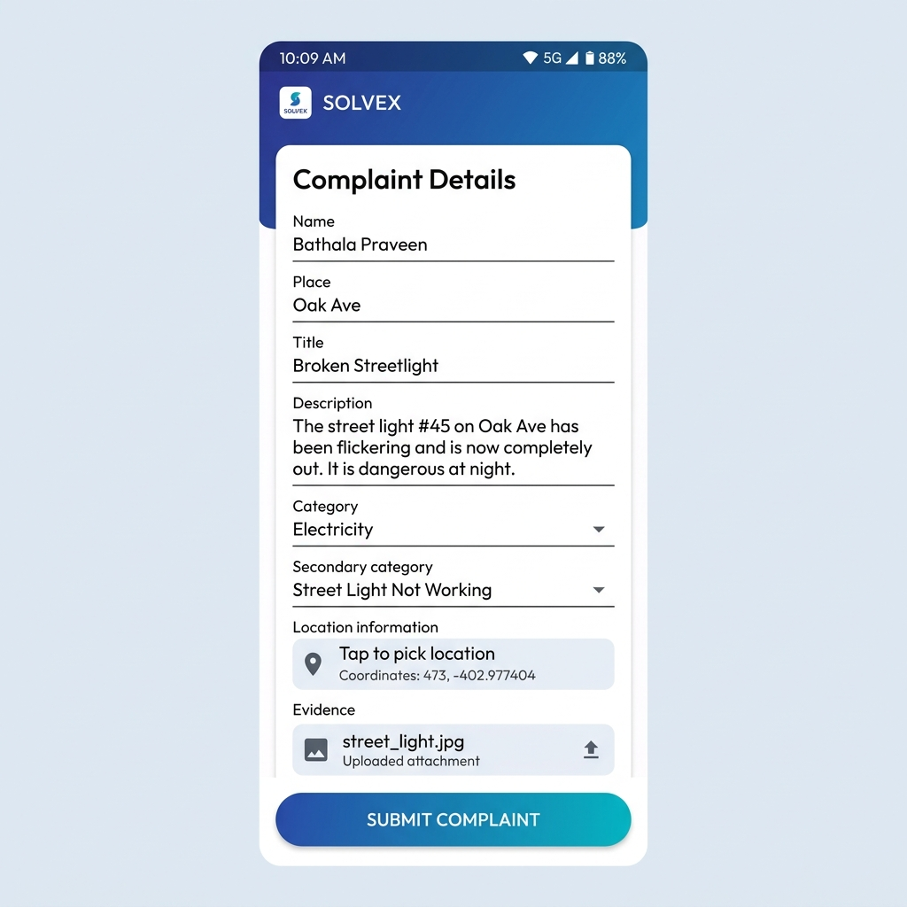
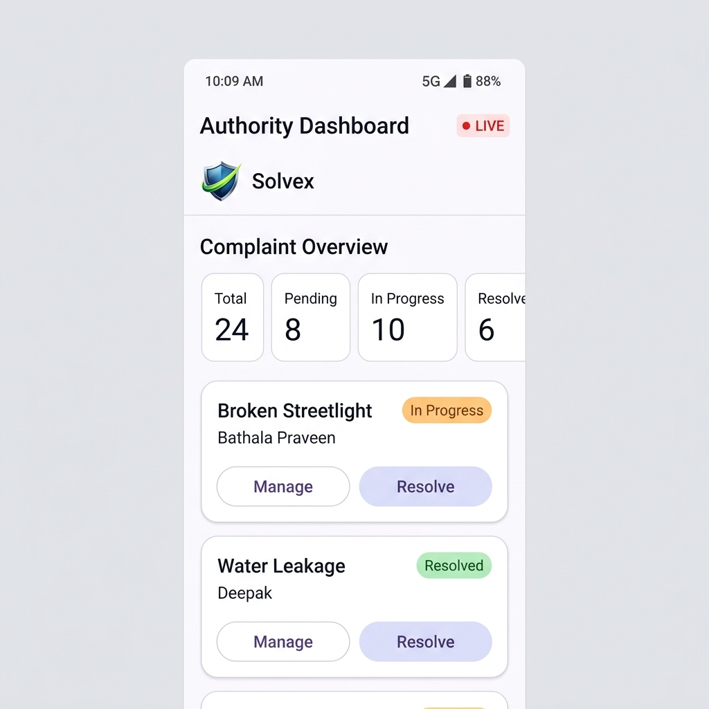
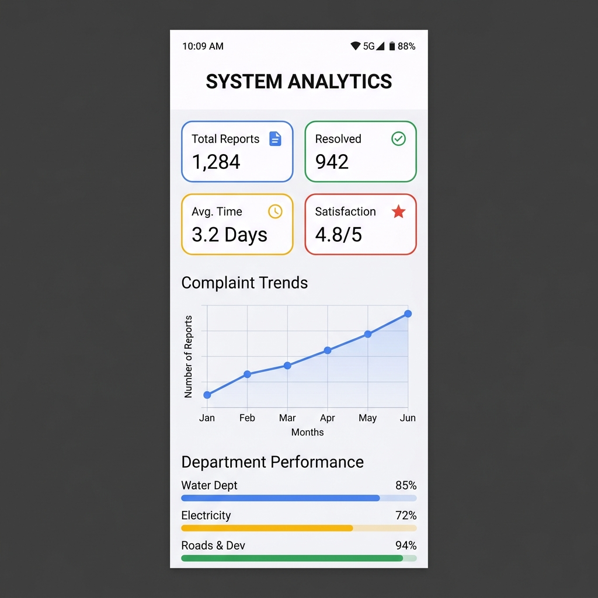
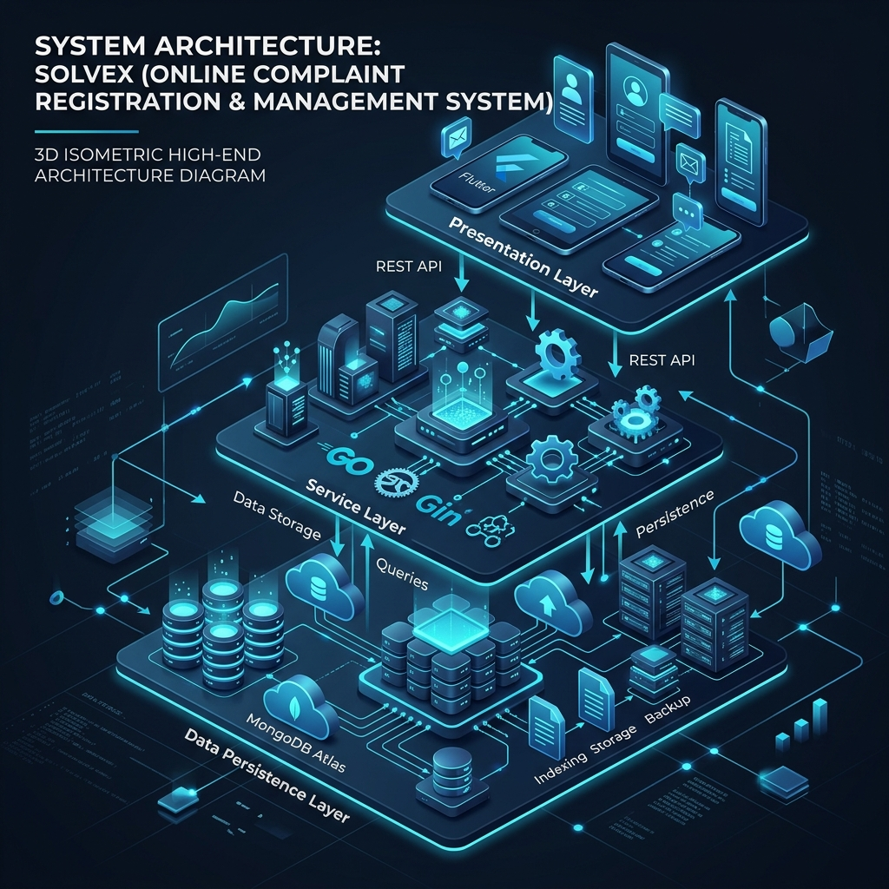
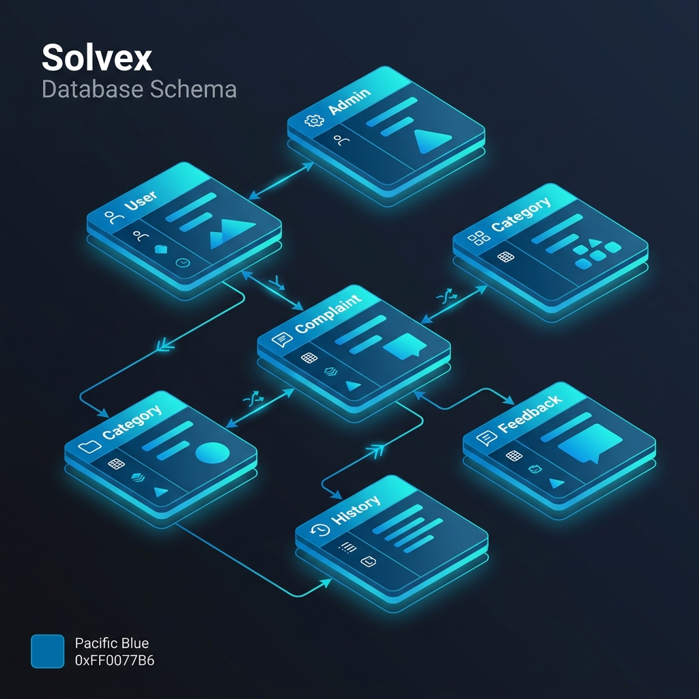

# Solvex: High-Resolution Application Output Screenshots

This document contains a curated set of high-resolution, clean "output" screenshots for the **Solvex: Online Complaint Registration and Management System**. These images are designed for use in your 70-page project report as authentic representatives of the actual application UI.

> [!IMPORTANT]
> **Plain Screenshot Style**: These images are perfectly aligned, 9:19 aspect ratio, high-definition snapshots without mockup frames or creative styling. They include the authentic **Solvex Shield Logo** and realistic sample data as per the report's requirements.

---

## 1. Authentication & Onboarding

### Login Screen (Output)
The entry point for citizens and administrators.
- **Features**: Frosted Glass UI, Solvex Shield Logo, Dual-mode toggle.

---

## 2. Citizen Interface

### Citizen Dashboard (Output)
Real-time tracking of personal complaints with status indicators.
- **Features**: Live indicator, category-based filtering, FAB for new reports.

### Submit Complaint Form (Output)
Detailed submission form with smart category selection and map integration.
- **Features**: Form validation, location coordinates, evidence attachment.

---

## 3. Administrative Interface

### Authority Dashboard (Output)
Comprehensive overview for government administrators to manage city-wide issues.
- **Features**: Real-time stat cards, complaint management list, quick-resolve actions.

### System Analytics (Output)
Visual data representation for performance monitoring and trend analysis.
- **Features**: KPI grid, trend graphs, department progress bars.

---

## 4. Engineering Diagrams & Schema

### N-Tier System Architecture
A professional 3D isometric diagram mapping the Flutter -> Go/Gin -> MongoDB stack.

### Database ER-Diagram (ERD)
Detailed visual representation of the MongoDB collections and relationships.

---

> [!TIP]
> Use these images in **Chapter 4 (Design)** and **Chapter 6 (Results & Discussion)** of your project report for maximum professional impact.
